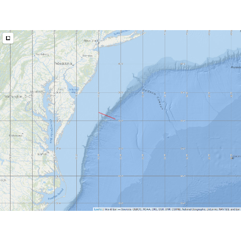
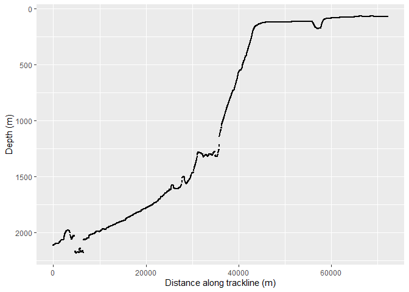
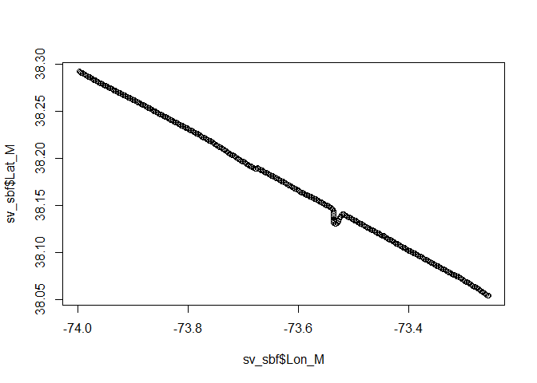
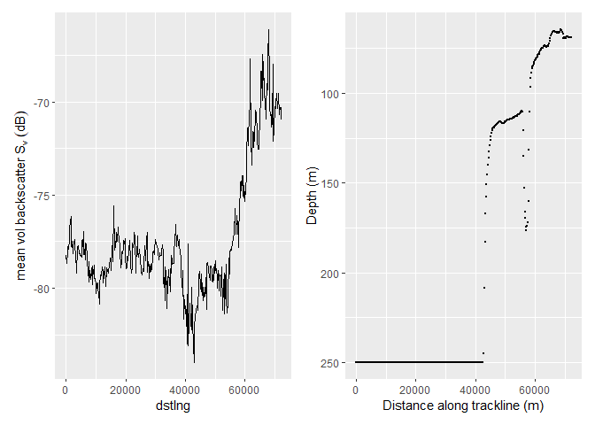
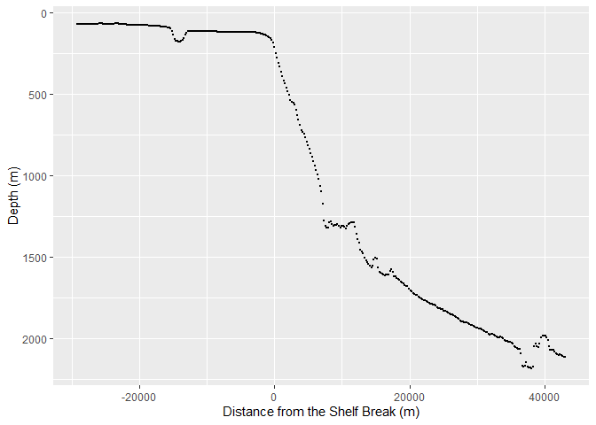
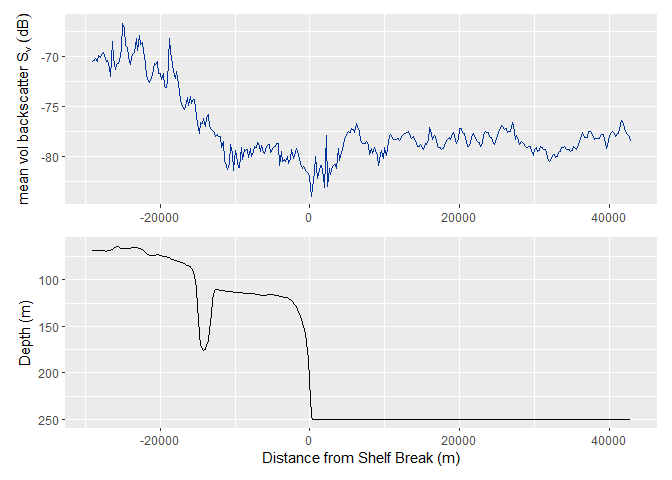

Cleaning and Plotting EK60 Data
================
Erin A. LaBrecque
January 3, 2020

## Background

Reflections. No, I’m not talking about contemplating your existence
within the Tidyverse or understanding what that spline did to your data.
I’m talking about echoes. Specifically, sound echoes called
“backscatter”, and how scientists use these to understand the
distribution of marine organisms in the ocean.

For many scientists who study the marine environment, especially
biological oceanographers and marine ecologists, the goal of using
active acoustic technologies is to extract biologically relevant
quantities from measures of backscatter. What are “biologically relevant
quantities” you ask? Great question. These are data that help us answer
the who, what, why, where, when, and how questions. Who/what is in the
water column? Why is it there? When is it there? Where is it within the
water column or in relation to other physical features? How did it get
there?

Since World War II, the use of echosounders has allowed scientists to
locate and visualize the distributions, abundance, and behavior of fish
and zooplankton. Unlike passive acoustic technologies which only listen
and record sound, echosounders produce sound signals (pings) at specific
frequencies and durations that are transmitted into the ocean. When
these signals encounter something with a different density than the
surrounding water, sound is reflected back in the direction it came
from. Thus, “backscatter”. Backscatter is recorded by the echosounder
and useful parameters are calculated from the received signal including
the position of the source of the scattering (“where”?) and the
intensity of the backscatter in decibels (dB) (“who/what”?). Active
acoustic technologies are a unique remote sensing tool that samples
aquatic environments at fine temporal and spatial scales and allow
scientists to take acoustic “snap-shots” of a 3-dimensional environment.

In this exercise, we are going to load, clean, and plot bathymetric data
(depth of the seafloor) to examine the shelf break, and the mean
volumetric backscatter (S<sub>v</sub>, dB re 1 m) along a transect in
the Mid-Atlantic Bight area of the North Atlantic Ocean.


The red line is the ship’s transect across the shelf break in the
Mid-Atlantic Bight. But what is a shelf break? A shelf break is the
submerged edge of the continental shelf and is characterized by a steep
increase in slope gradients. It’s “The Big Drop-off”. The shelf break
region of the Mid-Atlantic Bight is comprised of the outer continental
shelf and upper continental slope. It is a highly dynamic and productive
area that provides a wide range of habitat for many marine species from
the smallest phytoplankton to the some of largest marine mammals and
sharks, seabirds, tunas, and sea turtles. Several water masses with
distinct temperature and salinity properties converge at the shelf
break, creating one of the most oceanographically complex areas off the
eastern United States… and we’re going to play with some active acoustic
data from this amazing region\!

<br>

## General Methods

Data were collected in June 2011 and processed using the acoustic
processing software, [Echoview](https://www.echoview.com/). Mean
volumetric backscatter (S<sub>v</sub>, dB re 1 m) was integrated into
200 meter horizontal bins and 250 meter vertical bins. For this example,
we are going to look at backscatter from the 38 kHz transducer that was
categorized as scattering from large fish with swim-bladders. If you are
interested in learning more about fisheries and zooplankton acoustics, a
good place to start is [*Fisheries Acoustics: Theory and
Practice*](https://www.wiley.com/en-us/Fisheries+Acoustics%3A+Theory+and+Practice%2C+2nd+Edition-p-9780470995297)
by John Simmonds, David N. MacLennan.

We will be working with two data files.  
1\. Bathymetric point data that describe the depth of the seafloor
collected at an unknown resolution.  
2\. Integrated acoustic backscatter measured in decibels (S<sub>v</sub>,
dB re 1 m) at a resolution of 200 meters vertically (along the
trackline), and 250 meters vertically (through the water column).

This workflow is sectioned into three parts.

In Part 1, we will read in the bathymetric point data collected from the
echosounders, check that all the positional data (longitude and
latitude) are valid, and calculate ship speed, sampling resolution, and
the time difference between samples. We will also plot the bathymetry,
calculate and compare the straight line distance between the start and
end points of the transect and the cumulative distance the ship
traveled.

In Part 2, we will read in the acoustic data exported from Echoview,
remove missing or bad positional (longitude and latitude) points, filter
the data to get the depth layer we are interested in examining, and plot
the mean S<sub>v</sub> in relation to the bathymetry and distance along
the trackline.

In Part 3, we will find the shelf break and reorient all the data to
shelf break = 0 meters, and re-grid the data into equidistant spacing.
Distances heading onshore will be negative. Distances heading offshore
will be positive.

<br>

## Part 1

Load the libraries for Part 1.

``` r
library(tidyverse)
library(lubridate)
library(geosphere)
```

<br>

The full data set for this research cruise consists of 52 S<sub>v</sub>
files (each transect has a fish-like scattering file and a
zooplankton-like scattering file), and 26 files of bathymetry data. The
workflow is the same for each file, but files are named by date,
transect line, and frequency of the transducer (echosounder). Instead of
changing the file name every time a data file is read in, let’s create
variables that represent the date (dt) and transect line (line). In Part
2 we will also create a variable that defines the frequency we are
examining. To save us the headache of running each file separately, we
could also loop through a list of the files in the directory, but we’re
only working with one S<sub>v</sub> file and one bathymetry file today,
so we’ll keep it simple.  
<br>

Read in the bathymetry point data and take a glimpse.

``` r
dt <- '0616'
line <- '21_D_SB'

bot <- read_csv(paste0("data/",dt, "_", line, "_bottom.line.csv"), 
                       col_types = cols(Ping_date = col_datetime(format = "%m/%d/%Y")))
glimpse(bot)
```

    ## Observations: 2,766
    ## Variables: 11
    ## $ Ping_date         <dttm> 2011-06-16, 2011-06-16, 2011-06-16, 2011-06-16, ...
    ## $ Ping_time         <time> 17:14:08, 17:14:13, 17:23:18, 17:23:23, 17:23:28...
    ## $ Ping_milliseconds <dbl> 85, 85, 319, 319, 319, 319, 319, 319, 319, 319, 3...
    ## $ Latitude          <dbl> 999.00000, 38.05556, 38.05411, 38.05425, 38.05439...
    ## $ Longitude         <dbl> 999.00000, -73.24703, -73.25597, -73.25618, -73.2...
    ## $ Position_status   <dbl> 4, 3, 1, 1, 1, 1, 1, 1, 1, 1, 1, 1, 1, 1, 1, 1, 1...
    ## $ Depth             <dbl> 2147.355, 2147.355, 2115.710, 2115.098, 2113.849,...
    ## $ Line_status       <dbl> 1, 1, 1, 1, 1, 1, 1, 1, 1, 1, 1, 1, 1, 1, 1, 1, 1...
    ## $ Ping_status       <dbl> 0, 0, 0, 0, 0, 0, 0, 0, 0, 0, 0, 0, 0, 0, 0, 0, 0...
    ## $ Altitude          <dbl> -9.9e+37, 0.0e+00, 0.0e+00, 0.0e+00, 0.0e+00, 0.0...
    ## $ GPS_UTC_time      <chr> "-1", "17:14:22", "17:23:27", "17:23:32", "17:23:...

<br> Bad position points (Position\_status) are common at the beginning
and end of these types of files. There are also times the GPS might lose
its signal or the data stream might be corrupted. We need to find and
remove all the bad positional data points. From the [Echoview help
files](https://support.echoview.com/WebHelp/Using_Echoview/Exporting/Exporting_data/Exporting_line_data.htm),
we know that all good positional data are coded as “1”. Let’s keep all
the good positional data and make a quick plot of the transect to make
sure there are no stray bad data points.

``` r
bot <- bot %>%
  filter(Position_status == 1)

plot(bot$Longitude, bot$Latitude)
```

<!-- -->

Don’t worry about the little jaunt out and back off the trackline.
Sometimes the ship needs to move off the trackline to avoid fishing gear
or to identify and count species of interest at the surface.  
<br> Now that we have clean positional data, let’s create a datetime
column (DT), and columns that contain the calculated distance between
each consecutive point in meters (dist), the cumulative distance
traveled at each point in meters (dstlng), the time difference between
each point in seconds (t\_diff), and the speed of the ship in meters per
second (m\_per\_sec). We will calculate the distance between points
using `distHaversine()` from the `geosphere` package. `distHaversine()`
calculates the shortest distance between points on the earth using the
‘Haversine method’. This method ignores ellipsoidal effects and
assumes a spherical earth and is reasonable for our calculations.

``` r
bot <- bot %>% 
  select(Ping_date, Ping_time, Latitude, Longitude, Depth) %>%
  mutate(DT = Ping_date + Ping_time,
         dist = c(0,
                     distHaversine(cbind(Longitude[-n()], Latitude[-n()]),      
                                   cbind(Longitude[  -1], Latitude[  -1]))),
         dstlng = cumsum(dist),
         t_diff = c(NA, difftime(DT[ -1], DT[-n()], units = "secs")),
         m_per_sec = dist/t_diff)

glimpse(bot)
```

    ## Observations: 2,764
    ## Variables: 10
    ## $ Ping_date <dttm> 2011-06-16, 2011-06-16, 2011-06-16, 2011-06-16, 2011-06-...
    ## $ Ping_time <time> 17:23:18, 17:23:23, 17:23:28, 17:23:33, 17:23:38, 17:23:...
    ## $ Latitude  <dbl> 38.05411, 38.05425, 38.05439, 38.05450, 38.05460, 38.0546...
    ## $ Longitude <dbl> -73.25597, -73.25618, -73.25640, -73.25663, -73.25688, -7...
    ## $ Depth     <dbl> 2115.710, 2115.098, 2113.849, 2112.819, 2111.814, 2110.88...
    ## $ DT        <dttm> 2011-06-16 17:23:18, 2011-06-16 17:23:23, 2011-06-16 17:...
    ## $ dist      <dbl> 0.00000, 24.22069, 24.11925, 24.05192, 23.98324, 24.14136...
    ## $ dstlng    <dbl> 0.00000, 24.22069, 48.33993, 72.39185, 96.37510, 120.5164...
    ## $ t_diff    <dbl> NA, 5, 5, 5, 5, 5, 5, 5, 5, 5, 5, 5, 5, 5, 5, 5, 5, 5, 5,...
    ## $ m_per_sec <dbl> NA, 4.844137, 4.823850, 4.810384, 4.796649, 4.828272, 4.7...

You might have noticed that we dropped the GPS-time column,
`GPS_UTC_time`, and created a new datetime column from `Ping_date` and
`Ping_time`. Why the extra work? Well, sometimes people forget to make
sure the computer’s clock is synced to the ship’s GPS system.
`Ping_date` and `Ping_time` came from the clock on the computer that
recorded the data. `GPS_UTC_time` came from the
[NMEA](https://en.wikipedia.org/wiki/NMEA_2000_) stream sent from the
GPS unit. To be consistent with the S<sub>v</sub> data (computer’s
clock), we created a new time stamp for the bathymetry data from the
computer’s clock. Now you’re probably wondering why Echoview would use
the computer’s clock instead of the satellite-linked GPS clock. You’ll
have to ask the software engineers at Echoview about that, but it’s
probably because some platforms cannot get a GPS signal (e.g. bottom
mounted systems, autonomous systems), but the data still need a time
stamp.

Always remember to sync your computer’s clock to the ship’s GPS\!

<br>

Now let’s plot the depth of the seafloor along the transect to see what
the bathymetry looks like. We know the ship crossed the shelf break so
we should see a steep rise in the bathymetry about halfway along the
transect. We’re going to reverse the y axis because the surface of the
water is 0 meters by convention.

``` r
ggplot(bot, aes(dstlng, Depth)) +
  geom_point(size = 0.5) +
  scale_y_reverse() +
  labs(x = "Distance along trackline (m)", y = "Depth (m)")
```

<!-- -->
<br>

Earlier we calculated the the cumulative distance traveled in meters. To
compare the distance traveled by the ship to the distance between the
start and end points of the transect, we’ll use `distHaversine()` again.

First let’s get the cumulative distance.

``` r
(cumsum_dst <- tail(bot$dstlng, 1))
```

    ## [1] 72188.46

<br> Now let’s calculate the straight line distance between the
beginning and end of the transect.

``` r
strt <- cbind(bot$Longitude[1], bot$Latitude[1])
end <- cbind(bot$Longitude[nrow(bot)], bot$Latitude[nrow(bot)])


(strght_ln_dst <-  distHaversine(strt, end))
```

    ## [1] 70131.76

<br> What is the difference between the cumulative distance traveled by
the ship and the straight line distance between the start and end points
of the transect?

``` r
cumsum_dst - strght_ln_dst
```

    ## [1] 2056.703

Just over 2 km\!

<br>

What is the mean ping rate (pings/sec), and sampling resolution?

``` r
bot %>% 
  summarize(`Ping per Second` = 1/mean(t_diff, na.rm = TRUE),
            `Ping per Meter` = mean(t_diff, na.rm = TRUE)/mean(m_per_sec, na.rm = TRUE))
```

    ## # A tibble: 1 x 2
    ##   `Ping per Second` `Ping per Meter`
    ##               <dbl>            <dbl>
    ## 1             0.199            0.966

<br>

## Part 2

<br> First thing we need to do in Part 2 is load `gridExtra` for plots
later in this section, and then load the S<sub>v</sub> data. If you
remember from the General Methods section, there are two types of
S<sub>v</sub> files: one for fish-like backscatter (38 kHz) and one for
zooplankton-like backscatter (120 kHz). To load the fish-like
backscatter file we need to give the file name the correct frequency
(frq1) and specify the horizontal resolution (hr\_res).

``` r
library(patchwork)
```

``` r
frq1 <- '038_lgSBF'
hr_res <- '200'

dta_250_sb <- read_csv(paste0("data/",dt, "_", line, "_", frq1, "_", hr_res, "_full.csv"),
                       col_types = cols(Date_M = col_datetime(format = "%Y%m%d")))
```

<br>

For data files with many variables that are not too large, it’s my
personal preference to keep a copy of the original data file in the
environment. Although we’re not looping through the data files in the
directory, renaming the S<sub>v</sub> file here makes running through
the loop easier.

``` r
sv_sbf <- dta_250_sb

glimpse(sv_sbf)
```

    ## Observations: 728
    ## Variables: 82
    ## $ Process_ID                           <dbl> 14676, 14676, 14676, 14676, 14...
    ## $ Interval                             <dbl> 1, 1, 14, 14, 15, 15, 16, 16, ...
    ## $ Layer                                <dbl> 1, 2, 1, 2, 1, 2, 1, 2, 1, 2, ...
    ## $ Sv_mean                              <dbl> -77.59166, -999.00000, -78.228...
    ## $ NASC                                 <dbl> 90.05477, 0.00000, 77.77724, 0...
    ## $ Sv_max                               <dbl> -64.27222, -999.00000, -65.134...
    ## $ Sv_min                               <dbl> -81.88219, -999.00000, -85.674...
    ## $ Sv_noise                             <dbl> -967.0823, -999.0000, -962.785...
    ## $ NASC_noise                           <dbl> 0, 0, 0, 0, 0, 0, 0, 0, 0, 0, ...
    ## $ Height_mean                          <dbl> 120, 3, 120, 3, 240, 6, 240, 6...
    ## $ Depth_mean                           <dbl> 130, 253, 130, 253, 130, 253, ...
    ## $ Good_samples                         <dbl> 240, 6, 240, 6, 1920, 48, 1920...
    ## $ Layer_depth_min                      <dbl> 0, 250, 0, 250, 0, 250, 0, 250...
    ## $ Layer_depth_max                      <dbl> 250, 500, 250, 500, 250, 500, ...
    ## $ Ping_S                               <dbl> 0, 0, 2, 2, 4, 4, 12, 12, 20, ...
    ## $ Ping_E                               <dbl> 1, 1, 3, 3, 11, 11, 19, 19, 27...
    ## $ Ping_M                               <dbl> 0, 0, 2, 2, 7, 7, 15, 15, 23, ...
    ## $ Dist_S                               <dbl> 0.000, 0.000, 2769.920, 2769.9...
    ## $ Dist_E                               <dbl> 26.48558, 26.48558, 2794.14179...
    ## $ Dist_M                               <dbl> 0.000, 0.000, 2769.920, 2769.9...
    ## $ VL_start                             <dbl> 0.000, 0.000, 2725.216, 2725.2...
    ## $ VL_end                               <dbl> 25.76747, 25.76747, 2749.38267...
    ## $ VL_mid                               <dbl> 0.000, 0.000, 2725.216, 2725.2...
    ## $ Date_S                               <dbl> 20110616, 20110616, 20110616, ...
    ## $ Time_S                               <time> 17:14:08, 17:14:08, 17:23:18,...
    ## $ Date_E                               <dbl> 20110616, 20110616, 20110616, ...
    ## $ Time_E                               <time> 17:14:13, 17:14:13, 17:23:23,...
    ## $ Date_M                               <dttm> 2011-06-16, 2011-06-16, 2011-...
    ## $ Time_M                               <time> 17:14:08, 17:14:08, 17:23:18,...
    ## $ Lat_S                                <dbl> 999.00000, 999.00000, 38.05411...
    ## $ Lon_S                                <dbl> 999.00000, 999.00000, -73.2559...
    ## $ Lat_E                                <dbl> 38.05556, 38.05556, 38.05425, ...
    ## $ Lon_E                                <dbl> -73.24703, -73.24703, -73.2561...
    ## $ Lat_M                                <dbl> 999.00000, 999.00000, 38.05411...
    ## $ Lon_M                                <dbl> 999.00000, 999.00000, -73.2559...
    ## $ Exclude_below_line_depth_mean        <dbl> 2147.355, 2147.355, 2115.404, ...
    ## $ Program_version                      <chr> "\"9.0.318.34509\"", "\"9.0.31...
    ## $ Processing_version                   <dbl> 3, 3, 3, 3, 3, 3, 3, 3, 3, 3, ...
    ## $ Processing_date                      <dbl> 20180919, 20180919, 20180919, ...
    ## $ Processing_time                      <time> 15:29:20, 15:29:20, 15:29:20,...
    ## $ Alpha                                <dbl> 0.007856, 0.007856, 0.007856, ...
    ## $ Gain_constant                        <dbl> -9999, -9999, -9999, -9999, -9...
    ## $ Noise_Sv_1m                          <dbl> -999, -999, -999, -999, -999, ...
    ## $ Minimum_Sv_threshold_applied         <dbl> 1, 1, 1, 1, 1, 1, 1, 1, 1, 1, ...
    ## $ Minimum_integration_threshold        <dbl> -90, -90, -90, -90, -90, -90, ...
    ## $ Maximum_Sv_threshold_applied         <dbl> 0, 0, 0, 0, 0, 0, 0, 0, 0, 0, ...
    ## $ Maximum_integration_threshold        <dbl> 99, 99, 99, 99, 99, 99, 99, 99...
    ## $ Exclude_above_line_applied           <dbl> 1, 1, 1, 1, 1, 1, 1, 1, 1, 1, ...
    ## $ Exclude_above_line_depth_mean        <dbl> 10, 10, 10, 10, 10, 10, 10, 10...
    ## $ Exclude_below_line_applied           <dbl> 1, 1, 1, 1, 1, 1, 1, 1, 1, 1, ...
    ## $ Bottom_offset                        <dbl> 0, 0, 0, 0, 0, 0, 0, 0, 0, 0, ...
    ## $ Standard_deviation                   <dbl> 5.20938e-08, 0.00000e+00, 3.86...
    ## $ Skewness                             <dbl> 4.182329, 0.000000, 4.029217, ...
    ## $ Kurtosis                             <dbl> 19.76388, 0.00000, 20.09853, 0...
    ## $ ABC                                  <dbl> 2.08937e-06, 0.00000e+00, 1.80...
    ## $ ABC_noise                            <dbl> 0, 0, 0, 0, 0, 0, 0, 0, 0, 0, ...
    ## $ Area_Backscatter_Strength            <dbl> -56.79985, -9999.00000, -57.43...
    ## $ Thickness_mean                       <dbl> 120, 3, 120, 3, 240, 6, 240, 6...
    ## $ Range_mean                           <dbl> 124, 247, 124, 247, 124, 247, ...
    ## $ Exclude_below_line_range_mean        <dbl> 2141.355, 2141.355, 2109.404, ...
    ## $ Exclude_above_line_range_mean        <dbl> 4, 4, 4, 4, 4, 4, 4, 4, 4, 4, ...
    ## $ Bad_data_no_data_samples             <dbl> 240, 6, 240, 6, 0, 0, 0, 0, 0,...
    ## $ Beam_volume_sum                      <dbl> 40276.007, 3044.855, 40276.007...
    ## $ No_data_samples                      <dbl> 0, 0, 0, 0, 0, 0, 0, 0, 0, 0, ...
    ## $ C_good_samples                       <dbl> 240, 6, 240, 6, 1920, 48, 1920...
    ## $ C_bad_data_no_data_samples           <dbl> 240, 6, 240, 6, 0, 0, 0, 0, 0,...
    ## $ C_no_data_samples                    <dbl> 0, 0, 0, 0, 0, 0, 0, 0, 0, 0, ...
    ## $ Frequency                            <dbl> 38, 38, 38, 38, 38, 38, 38, 38...
    ## $ Grid_reference_line                  <chr> "\"Surface (depth of zero)\"",...
    ## $ Layer_top_to_reference_line_depth    <dbl> 0, 250, 0, 250, 0, 250, 0, 250...
    ## $ Layer_top_to_reference_line_range    <dbl> -6, 244, -6, 244, -6, 244, -6,...
    ## $ Layer_bottom_to_reference_line_depth <dbl> 250, 500, 250, 500, 250, 500, ...
    ## $ Layer_bottom_to_reference_line_range <dbl> 244, 494, 244, 494, 244, 494, ...
    ## $ Exclude_below_line_depth_min         <dbl> 2147.355, 2147.355, 2115.098, ...
    ## $ Exclude_below_line_range_min         <dbl> 2141.355, 2141.355, 2109.098, ...
    ## $ Exclude_below_line_depth_max         <dbl> 2147.355, 2147.355, 2115.710, ...
    ## $ Exclude_below_line_range_max         <dbl> 2141.355, 2141.355, 2109.710, ...
    ## $ Samples_Below_Bottom_Exclusion       <dbl> 0, 0, 0, 0, 0, 0, 0, 0, 0, 0, ...
    ## $ Samples_Above_Surface_Exclusion      <dbl> 8, 0, 8, 0, 32, 0, 32, 0, 32, ...
    ## $ Samples_In_Domain                    <dbl> 488, 12, 488, 12, 1952, 48, 19...
    ## $ Bad_data_empty_water_samples         <dbl> 0, 0, 0, 0, 0, 0, 0, 0, 0, 0, ...
    ## $ C_bad_data_empty_water_samples       <dbl> 0, 0, 0, 0, 0, 0, 0, 0, 0, 0, ...

Woah\! 728 observations of 83 variables\! What is all this??? This is
the full data export from Echoview, but remember, we’re only interested
in the S<sub>v</sub> data (Sv\_mean). What will we need to combine the
S<sub>v</sub> data with the bathymetry data and examine it? My
explanation of why we’re using the computer’s time stamp in Part 1
should have given you a big hint that we’ll need the time and date
columns. We’ll also need the latitude and longitude columns, and the
Interval and the Layer columns.

If you would like to explore the other variables in the data file,
Echoview’s help files provide definitions of all the exported variables.
To save you the time of pursuing through the help files, here’s the
information on the few variables we need. Interval is the horizontal
grid number and Layer is the vertical grid number. These backscatter
data were integrated (averaged) into grid cells that are 200 meters
along the ship’s path by 250 meters deep. Layer 1 is the data integrated
from the near surface to 250 meters depth. Layer 2 is the data
integrated from 250.1 meters to 500 meters depth, and so on. Interval 1
is the first 200 meter grid cell and Interval 2 is the second 200 meter
grid cell. As you can imagine, Interval and Layer are used as a type of
coordinate system referenced to the ship’s path and depth. For this
exercise, we are only interested in the first depth layer and will be
removing all the other layers.

There are three date, time, latitude, and longitude columns. The suffix
represents the order. For example, the suffix "\_S" is for the start of
the grid cell, "\_M" is for the middle of the grid cell, and "\_E" is
for the end of the grid cell.

But first thing is first. We’ve got some bad positional data (999.000)
in the latitude and longitude columns. Let’s remove the bad grid cells
and make a quick plot using the grid midpoints to make sure there are no
stray bad data points.

``` r
sv_sbf <- sv_sbf %>%
  filter(Lon_M != 999.0) 

plot(sv_sbf$Lon_M, sv_sbf$Lat_M)
```

<!-- -->

Looks a lot like the plot from Part 1. That’s good\!

<br>

Now for some data cleaning. We’ll select the columns we want, rename
Interval to make it less confusing when creating a time interval, create
datetime columns for the start, middle, and end datetime stamps,
calculate the distance along the transect in meters and the cumulative
distance the ship has traveled in meters using `distHaversine()` again,
replace any “-999” with “NA”, and finally, create a time interval for
each grid cell from the start and end datetime stamp.

``` r
sv_sbf <- sv_sbf %>%
  select(Interval, Layer, Sv_mean, Frequency, Depth_mean, Ping_S, Ping_M, Ping_E, Date_M, Time_S, Time_M, Time_E, Lat_S, Lat_M, Lat_E, Lon_S, Lon_M, Lon_E) %>%
  rename(int_along = Interval) %>%
  filter(Layer == 1)  %>%
  mutate(DT_S = Date_M + Time_S,
         DT_M = Date_M + Time_M,
         DT_E = Date_M + Time_E) %>%
  filter(Layer == 1)  %>%
  arrange(DT_S) %>%
  mutate(dist_M = c(0, distHaversine(cbind(Lon_M[-n()], Lat_M[-n()]),       
                                     cbind(Lon_M[  -1], Lat_M[  -1]))),
         dstlng = cumsum(dist_M)) %>%
  na_if(-999) %>%
  mutate(intvr = interval(DT_S, DT_E))
```

<br>

Great\! All this is coming together nicely. We have bathymetry, `bot`,
with the depth of the seafloor along the transect, distances, and time
stamps. We now also have a clean S<sub>v</sub> file, `sv_sbf`, with time
stamps, distances, but no depth information. There was a depth column in
the raw S<sub>v</sub> file, `Layer_depth_max`, but the resolution was
not adequate to capture the shelf break.

How do we combine the depth data with the S<sub>v</sub> data? One way to
do this is assign Interval values (int\_along) from `sv_sbf` to `bot`
based on time stamps and join them. This little function helps with the
first part.

``` r
ff <- function(x){
  res <- sv_sbf$int_along[x %within% sv_sbf$intvr] 
  # deal with the NA case
  if(length(res)==0) return(NA)
  return(res)
}
```

Now we’ll create a new column in `bot` called `int_along_b` that will be
the Interval value (int\_along) from `sv_sbf` based on the time stamp
from `bot` being in a time interval in `sv_sbf`.

``` r
bot <- bot %>% 
  mutate(int_along_b = map_dbl(DT, ff))
glimpse(bot)
```

    ## Observations: 2,764
    ## Variables: 11
    ## $ Ping_date   <dttm> 2011-06-16, 2011-06-16, 2011-06-16, 2011-06-16, 2011-0...
    ## $ Ping_time   <time> 17:23:18, 17:23:23, 17:23:28, 17:23:33, 17:23:38, 17:2...
    ## $ Latitude    <dbl> 38.05411, 38.05425, 38.05439, 38.05450, 38.05460, 38.05...
    ## $ Longitude   <dbl> -73.25597, -73.25618, -73.25640, -73.25663, -73.25688, ...
    ## $ Depth       <dbl> 2115.710, 2115.098, 2113.849, 2112.819, 2111.814, 2110....
    ## $ DT          <dttm> 2011-06-16 17:23:18, 2011-06-16 17:23:23, 2011-06-16 1...
    ## $ dist        <dbl> 0.00000, 24.22069, 24.11925, 24.05192, 23.98324, 24.141...
    ## $ dstlng      <dbl> 0.00000, 24.22069, 48.33993, 72.39185, 96.37510, 120.51...
    ## $ t_diff      <dbl> NA, 5, 5, 5, 5, 5, 5, 5, 5, 5, 5, 5, 5, 5, 5, 5, 5, 5, ...
    ## $ m_per_sec   <dbl> NA, 4.844137, 4.823850, 4.810384, 4.796649, 4.828272, 4...
    ## $ int_along_b <dbl> 14, 14, 15, 15, 15, 15, 15, 15, 15, 15, 16, 16, 16, 16,...

<br>

With the bathymetry data assigned the proper `int_along` value, we can
group bathymetry by the grid Interval and calculate the mean depth of
each grid Interval.

``` r
( bot_ints <- bot %>%
  group_by(int_along_b) %>%
  summarize(dpth_mean = mean(Depth)) %>%
  ungroup() )
```

    ## # A tibble: 363 x 2
    ##    int_along_b dpth_mean
    ##          <dbl>     <dbl>
    ##  1          14     2115.
    ##  2          15     2111.
    ##  3          16     2105.
    ##  4          17     2100.
    ##  5          18     2099.
    ##  6          19     2100.
    ##  7          20     2098.
    ##  8          21     2089.
    ##  9          22     2078.
    ## 10          23     2069.
    ## # ... with 353 more rows

<br>

Now we can join `bot_int` to `sv_sbf` to add the mean depths to the
S<sub>v</sub> data. A word of caution, intervals and periods from
`lubridate` do not play well with joins. Now that we’ve used the time
intervals, we’re going to drop them before the join. We’re also going to
add a column for plotting. Because we’re only working with one depth
layer, all bathymetry deeper than 250 m will be set to 250 m.

``` r
dta_sbf <- sv_sbf %>%
  select(-intvr) %>%
  left_join(bot_ints, by = c("int_along" = "int_along_b")) %>% 
  mutate(dpth_plot = ifelse(dpth_mean >= 250, 250, dpth_mean))

glimpse(dta_sbf)
```

    ## Observations: 363
    ## Variables: 25
    ## $ int_along  <dbl> 14, 15, 16, 17, 18, 19, 20, 21, 22, 23, 24, 25, 26, 27, ...
    ## $ Layer      <dbl> 1, 1, 1, 1, 1, 1, 1, 1, 1, 1, 1, 1, 1, 1, 1, 1, 1, 1, 1,...
    ## $ Sv_mean    <dbl> -78.22821, -78.67016, -78.07052, -77.74401, -77.89409, -...
    ## $ Frequency  <dbl> 38, 38, 38, 38, 38, 38, 38, 38, 38, 38, 38, 38, 38, 38, ...
    ## $ Depth_mean <dbl> 130, 130, 130, 130, 130, 130, 130, 130, 130, 130, 130, 1...
    ## $ Ping_S     <dbl> 2, 4, 12, 20, 28, 36, 44, 52, 59, 67, 75, 82, 89, 97, 10...
    ## $ Ping_M     <dbl> 2, 7, 15, 23, 31, 39, 47, 55, 62, 70, 78, 85, 92, 100, 1...
    ## $ Ping_E     <dbl> 3, 11, 19, 27, 35, 43, 51, 58, 66, 74, 81, 88, 96, 104, ...
    ## $ Date_M     <dttm> 2011-06-16, 2011-06-16, 2011-06-16, 2011-06-16, 2011-06...
    ## $ Time_S     <time> 17:23:18, 17:23:28, 17:24:08, 17:24:48, 17:25:28, 17:26...
    ## $ Time_M     <time> 17:23:18, 17:23:43, 17:24:23, 17:25:03, 17:25:43, 17:26...
    ## $ Time_E     <time> 17:23:23, 17:24:03, 17:24:43, 17:25:23, 17:26:03, 17:26...
    ## $ Lat_S      <dbl> 38.05411, 38.05439, 38.05511, 38.05588, 38.05671, 38.057...
    ## $ Lat_M      <dbl> 38.05411, 38.05469, 38.05538, 38.05619, 38.05703, 38.057...
    ## $ Lat_E      <dbl> 38.05425, 38.05502, 38.05577, 38.05660, 38.05745, 38.058...
    ## $ Lon_S      <dbl> -73.25597, -73.25640, -73.25839, -73.26043, -73.26244, -...
    ## $ Lon_M      <dbl> -73.25597, -73.25712, -73.25916, -73.26118, -73.26320, -...
    ## $ Lon_E      <dbl> -73.25618, -73.25814, -73.26017, -73.26219, -73.26423, -...
    ## $ DT_S       <dttm> 2011-06-16 17:23:18, 2011-06-16 17:23:28, 2011-06-16 17...
    ## $ DT_M       <dttm> 2011-06-16 17:23:18, 2011-06-16 17:23:43, 2011-06-16 17...
    ## $ DT_E       <dttm> 2011-06-16 17:23:23, 2011-06-16 17:24:03, 2011-06-16 17...
    ## $ dist_M     <dbl> 0.0000, 119.9391, 194.0141, 198.4825, 200.6834, 204.0740...
    ## $ dstlng     <dbl> 0.0000, 119.9391, 313.9532, 512.4357, 713.1191, 917.1931...
    ## $ dpth_mean  <dbl> 2115.404, 2110.868, 2105.078, 2099.904, 2099.134, 2099.7...
    ## $ dpth_plot  <dbl> 250, 250, 250, 250, 250, 250, 250, 250, 250, 250, 250, 2...

<br>

Plot the S<sub>v</sub> along the trackline in 2 panels. One panel for
the bathymetry and one panel for the S<sub>v</sub>.

``` r
bthy <- ggplot(dta_sbf, aes(dstlng, dpth_plot)) +
  geom_point(size = 0.5) +
  scale_y_reverse() +
  labs(x = "Distance along trackline (m)", y = "Depth (m)")

Sv_mean <- ggplot(dta_sbf, aes(dstlng, Sv_mean)) +
  geom_line() +
  theme(legend.position="none") +
  labs(y=expression(mean~vol~backscatter~S[v]~(dB)))   

Sv_mean + bthy
```

<!-- -->

  - How does the mean fish-with-swim-bladder-like backscatter change
    along the trackline?  
  - Where is it the greatest?  
  - Where is it the least?  
  - Anything interesting happen around the shelf break?

<br>

## Part 3

Almost to the final plot\! We have loaded, cleaned, and plotted the
bathymetry data, and loaded, cleaned, and plotted backscatter data
representative of fish with swim bladders. Now we are going to find the
shelf break and reorient and re-grid all the data to the shelf break.
Why? Because the shelf break is a static feature in this area that
influences the productivity in the region. Understanding what is
happening at distances to and from this position can help us understand
the mechanisms that drive species distributions in this region. And
also, these little exercises are part of a much larger course of
research in this area that require us to do this step.

How do we find the shelf break? Thankfully, many oceanographers have
already described the shelf break for us. The area of steepest slope is
approximately at 200 meters depth. We will find the closest bathymetric
data point to 200 m and get its index. Then we will use the index number
to find the distance along the trackline needed to reorient the shelf
break to 0 meters along the trackline. Although we are only looking at
one transect, the ship made several shelf break crossings, some starting
from the shelf, some starting from offshore. Because we are assigning
direction to ‘onshore’ and ‘offshore’ distances from the shelf break, we
need to flip the sign of the distance from the shelf break when starting
from offshore (bathymetry greater than 600 m).

``` r
sb <-  200
sb_idx <- which(abs(dta_sbf$dpth_mean - sb) == min(abs(dta_sbf$dpth_mean - sb)))

to_sbtrt <- dta_sbf$dstlng[sb_idx]

dta_sbf <- dta_sbf %>%
  mutate(dst_alng_png = dstlng - to_sbtrt,
         dst_alng_fn = case_when(dpth_mean[1] > 600 ~ dst_alng_png * -1))


ggplot(dta_sbf, aes(dst_alng_fn, dpth_mean)) +
  geom_point(size = 0.5) +
  scale_y_reverse() +
  labs(x = "Distance from the Shelf Break (m)", y = "Depth (m)")
```

<!-- -->

<br>

Now that we have found the shelf break and reoriented the bathymetry
data, we need to re-grid the spacing. Remember that little jaunt off the
trackline? All of our distances along the trackline have been slightly
skewed because we calculated the distance along the trackline from
consecutive position points. To correct this and to make sure the data
are equally spaced along the trackline orientated to the shelf break, we
are going to split the data into two sections and interpolate onto an
equidistant vector.

<br> But before we do that, we need to remember some high school math -
logs\! Decibels are the logarithmic version of the backscatter. Logs
have to be converted to the arithmetic form for interpolation.

``` r
dta_sbf <- dta_sbf %>%
  mutate(sv_ar = 10^(Sv_mean/10))
```

<br>

Now we can split the data into the onshore and offshore components for
interpolation. The first step is to pull out the onshore distances from
the shelf break and create an equally spaced transect. Remember `hr_res`
from back in Part 2? It pops up here to set the spacing. It was a
character type before, but we need it as an integer now.

``` r
trk_sh <- dta_sbf %>%
  select(dst_alng_fn) %>% 
  filter(dst_alng_fn <= 0) %>% 
  arrange(desc(dst_alng_fn)) #These are negative distances.

trk_pts_sh <- as.tibble(seq(floor(trk_sh$dst_alng_fn[1]), 
                            ceiling(trk_sh$dst_alng_fn[nrow(trk_sh)]), 
                            by = as.integer(hr_res) * -1)) %>% 
  rename(dst_alng_fn = value) %>% 
  arrange(dst_alng_fn) 
```

    ## Warning: `as.tibble()` is deprecated, use `as_tibble()` (but mind the new semantics).
    ## This warning is displayed once per session.

<br>

The second part is to pull out the offshore distances and create equally
spaced transect.

``` r
trk_os <- dta_sbf %>% 
  select(dst_alng_fn) %>% 
  filter(dst_alng_fn >= 0) %>% 
  arrange(dst_alng_fn) #These are positive distances.

trk_pts_os <- as.tibble(seq(floor(trk_os$dst_alng_fn[1]), 
                            ceiling(trk_os$dst_alng_fn[nrow(trk_os)]), 
                            by = as.integer(hr_res))) %>% 
  rename(dst_alng_fn = value)
```

<br>

Now we’ll put the equally spaced trackline back together and remove the
duplicated 0 m point.

``` r
trk_pts <- (bind_rows(rev(trk_pts_sh), trk_pts_os)) %>% 
  filter(!duplicated(dst_alng_fn)) 
```

<br>

To interpolate the arithmetic backscatter data and distance along the
trackline into the equally spaced trackline we just made, we will use
`approx()` with the default `method = "linear"`. First we will create
simple data frames of the arithmetic data and the depth data.

``` r
dat_sbf <- data.frame(
  x = dta_sbf$dst_alng_fn,
  y = dta_sbf$sv_ar)

dat_dp <- data.frame(
  x = dta_sbf$dst_alng_fn,
  y = dta_sbf$dpth_plot)
```

<br>

Now we will interpolate the arithmetic backscatter data, rename the
variables, and convert back to S<sub>v</sub>.

``` r
aprxDat_sb <- data.frame(with(dat_sbf, 
       approx(x, y, xout = as.numeric(unlist(trk_pts)), method = "linear")))

aprxDat_sb <- aprxDat_sb %>% 
  rename(Dist = x,
         sv_ar = y) %>% 
  mutate(Sv_mean = 10*log10(sv_ar))
```

<br>

And now for the bathymetric data.

``` r
aprxDat_dp <- data.frame(with(dat_dp, 
       approx(x, y, xout = as.numeric(unlist(trk_pts)), method = "linear")))

aprxDat_dp <- aprxDat_dp %>% 
  rename(Dist = x,
         dpth_intr = y)
```

<br>

Let’s put it all back together now and plot it out.

``` r
sbf_dta_plt <- tibble(Dist = aprxDat_sb$Dist, SBF = aprxDat_sb$Sv_mean, 
                      sbf_ar = aprxDat_sb$sv_ar, dpth_intr = aprxDat_dp$dpth_intr)


bthy <- ggplot(sbf_dta_plt, aes(Dist, dpth_intr)) +
  geom_line() +
  scale_y_reverse() +
  xlab("Distance from Shelf Break (m)") +
  ylab("Depth (m)") 
  

Sv_mean <- ggplot(sbf_dta_plt, aes(Dist, SBF)) +
  geom_line(color = "#003399") +
  labs(y=expression(mean~vol~backscatter~S[v]~(dB))) +
  theme(axis.title.x=element_blank())

Sv_mean / bthy
```

<!-- -->
<br>

Splendid\!

From the plot of S<sub>v</sub> along the transect, it looks like
scattering associated with fish with swim bladders is greatest in the
shallow areas over the shelf, drops to lowest values just before the
shelf break, and levels out around -75.25 dB offshore.
